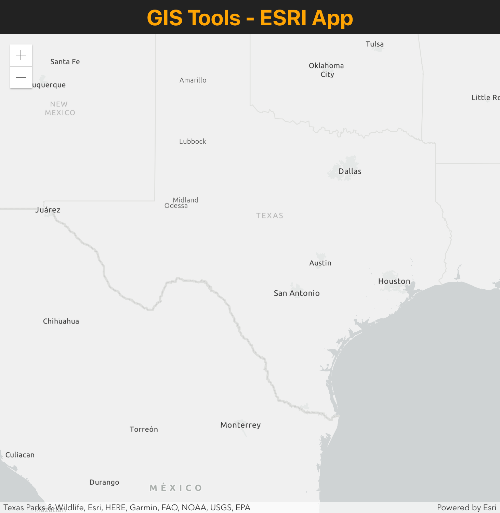

# Quickstart ESRI JS API Map with Create React App template

### Usage

```
npx create-react-app %PROJECT_NAME% --template map-esri-js

- or -

yarn create react-app %PROJECT_NAME% --template map-esri-js
```

---


